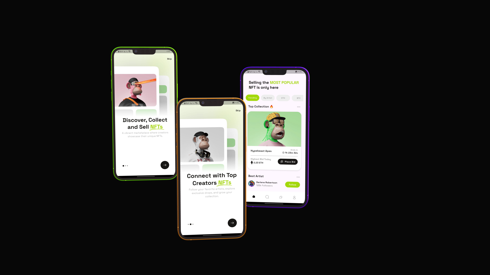

# Artify – NFT Collection Flutter App

**Artify** is a modern Flutter-based mobile application showcasing a digital NFT collection in a sleek and interactive UI. The app features custom components, tab-based navigation, and a clean architecture that emphasizes scalability and reusability.

## ✨ Features

- Modern UI using custom-styled components
- Tab-based navigation (Item’s / Activity)
- Image fade-in effects with custom `FadeOutImage`
- Watchlist and banner sections
- Responsive `GridView` to display NFT items
- Organized code structure (widgets, views, constants)
- Ready to be extended with backend or real data sources

## 📸 App Screenshot

  
  

